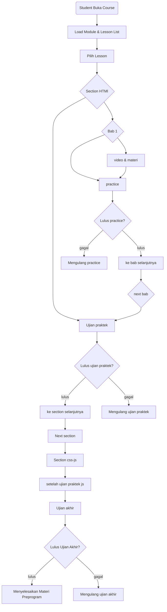

**Langkah:**

- Progress video: FE throttle `PUT /progress` tiap 10 detik + `onEnded` → 100%.
- Quiz: `quizzes` + `quiz_questions` → `quiz_attempts` hitung `passed`. Jika passed → lesson COMPLETED.
- Assignment: `submissions` status PENDING → Instructor `PATCH /submissions/:id/grade` → jika semua assignment lulus → course COMPLETED.
- XP & Leaderboard: service `Gamification` listen event `LESSON_COMPLETED` → `xp_logs` + `redis.zincrby(leaderboard:{tenantId}:{season}, xp, userId)`.
- Sertifikat: `certificates` dengan `code = nanoid(10)` → FE `/verify/[code]`.
