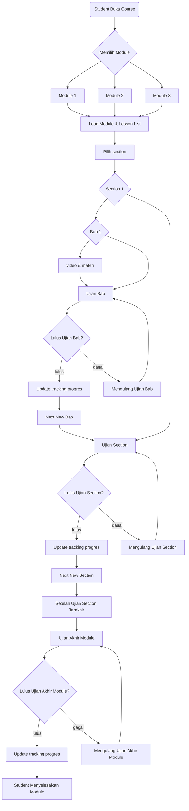
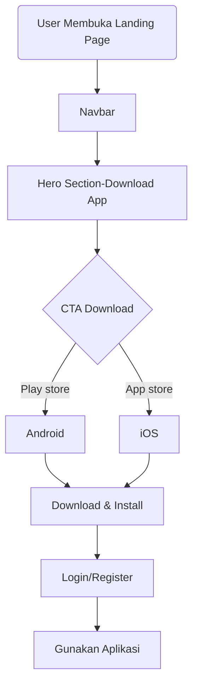

# Learning Flow

```mermaid
flowchart TD
A(Student Buka Course) --> B{Memilih Module}
B --> A2[Module 1]
B --> A3[Module 2]
B --> A4[Module 3]
A2 --> A1
A3 --> A1
A4 --> A1[Load Module & Lesson List]
A1 --> C[Pilih section]
C --> D{Section 1}
D --> E{Bab 1}
D --> F[Ujian Section]
E --> G[video & materi]
E --> H[Ujian Bab]
G --> H
H --> I{Lulus Ujian Bab?}
I --> |lulus| J[Update tracking progres]
I --> |gagal| K[Mengulang Ujian Bab]
K --> H
J --> L[Next New Bab]
L --> F
F --> M{Lulus Ujian Section?}
M --> |lulus| N1[Update tracking progres]
M --> |gagal| O[Mengulang Ujian Section]
O --> F
N1 --> N[Next New Section]


N --> R[Setelah Ujian Section Terakhir]
R --> S[Ujian Akhir Module]
S --> U{Lulus Ujian Akhir Module?}
U --> |lulus| V[Update tracking progres]
U --> |gagal| W[Mengulang Ujian Akhir Module]
W --> S
V --> X[Student Menyelesaikan Module]


   
```
---

# Landing Page guide

```mermaid
flowchart TD
A(User Membuka Landing Page) --> B[Navbar]
B --> C[Hero Section-Download App]
C --> D{CTA Download}
D --> |Play store| E[Android] 
D --> |App store| F[iOS]
E --> G[Download & Install]
F --> G
G --> H[Login/Register]
H --> I[Gunakan Aplikasi]


```
